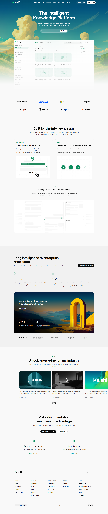

# 🚀 Mintlify Landing Page Project

🔗 **Live Demo:** <https://asifansari84.github.io/cursor-landing-page/>

## A modern landing page inspired by the clean documentation experience of Mintlify.

This project focuses on structured layout systems, documentation-style sections, developer-focused UI blocks, and minimal visual noise.

## ✨ Why This Project

This project was built to practice:

- Clean documentation-style layout
- Section-based structuring
- Spacing & typography hierarchy
- SaaS-style landing design
- Minimal and distraction-free UI
- Developer-first messaging

## 🛠 Technologies Used

- HTML5
- CSS3
- Clean Folder Structure
- Custom Fonts
- Static Deployment (GitHub Pages)

##📂 Project Structure

MINTLIFY LANDING PAGE
│
├── assets/ → Images & resources
├── assets/fonts → Custom fonts
├── style.css → Styling file
├── index.html → Main landing page file
└── README.md → Project documentation

## 🎯 Features

- Clean Hero Section
- Structured Content Blocks
- Documentation-style Layout
- Responsive Design
- Developer-Centric UI
- Organized File Architecture

## 🚀 How to Use

Step 1: Download or Clone
git clone https://github.com/asifansari84/cursor-landing-page.git

Step 2:

Open index.html in your browser.

## 💡 Purpose of This Project

This project was built to:

- Practice frontend layout skills
- Improve UI structuring
- Create clean developer-style landing pages
- Showcase design implementation ability

## 🙌 Thank You

Thank you for checking out this project.

This landing page reflects my frontend development skills, attention to clean design, and structured layout building.

If you like this project, feel free to ⭐ the repository and share your feedback.

## Happy Coding! 🚀
